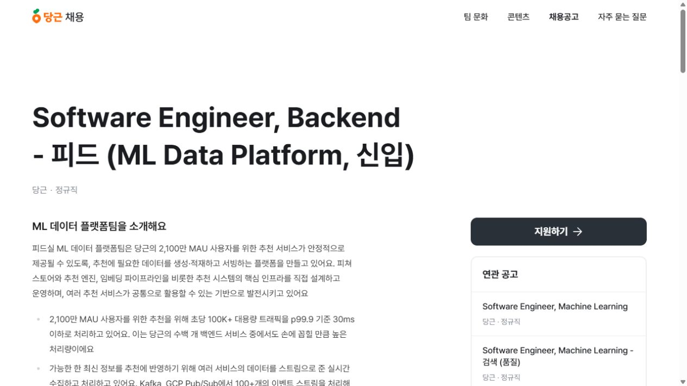
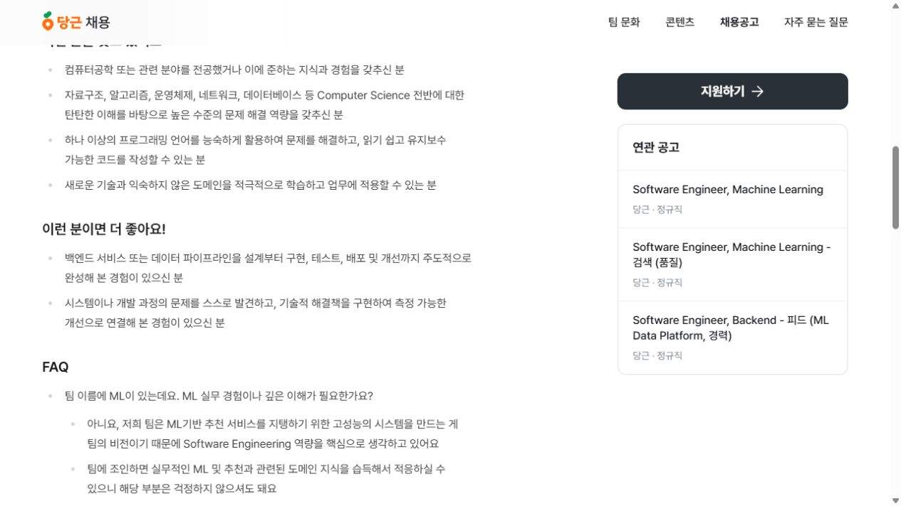

# 당근 신입 백엔드 공고 분석 근거

확인일: 2026.09.06. 실제 지원 시에는 원문을 다시 확인합니다.

공식 공고: [Software Engineer, Backend - 피드 (ML Data Platform, 신입)](https://careers.daangn.com/jobs/role/5823087003/)

## 공고에서 확인한 내용

- 회사·고용 형태: 당근, 신입 정규직.
- 주요 업무: 추천에 필요한 데이터를 처리·제공하는 시스템 개발과 운영, 성능·비용 개선, 데이터 품질 관찰.
- 기본 역량: CS 기초를 활용한 문제 해결, 한 언어의 활용과 코드 품질, 새로운 기술 학습.
- 우대 경험: 설계·구현·검사·배포·개선까지 완성한 경험과 측정으로 설명할 수 있는 개선.
- 공고 FAQ: 깊은 ML 실무 경험을 필수로 두기보다 소프트웨어 개발 역량을 중심으로 설명함.
- 전형: 서류, 화상 인터뷰와 라이브 코딩, 직무 인터뷰, 컬처핏·레퍼런스, 처우 협의, 입사.
- 라이브 코딩 선택 언어: C++, Go, Java, Python.

공고의 팀 사용 기술 목록을 모두 '신입 지원 전에 반드시 익혀야 하는 기술'로 바꾸어 해석하지 않습니다.

## 이 프로젝트와 연결한 판단

| 준비 항목 | 현재 근거 | 보완할 부분 |
| --- | --- | --- |
| 요청과 데이터 처리 | 클릭 API, 사용자별 DB 집계 | 인증·권한과 HTTP 기초 설명 |
| 실패 조건 처리 | 중복·충돌·저장 실패·동시 요청 검사 | 더 다양한 오류와 배포 환경 |
| 측정 가능한 개선 | 같은 SQL의 인덱스 전후 실험 | HTTP·쓰기·동시 부하 측정 |
| 끝까지 실행하는 경험 | 로컬 실행과 테스트, README | 인터넷 배포와 운영 기록 |

이 연결은 공고를 읽고 세운 지원 준비 판단입니다. 당근의 합격 기준이나 역량 평가 결과를 의미하지 않습니다. '합성 데이터의 SQL 조회'를 실제 당근 규모의 처리 경험으로 표현하지 않습니다.

## 지원 자료의 역할

발표 PPT에는 공고 해석과 자기 진단, 계획을 담습니다. 포트폴리오 PDF에는 수행한 프로젝트의 역할과 문제 해결 근거를 담습니다. 이력서는 본인의 실제 학력·경험 등 요약 이력을 담는 별도 문서입니다.

[당근 공식 FAQ](https://careers.daangn.com/faq/지원-관련/)에 따르면 자유 양식이며 PDF가 권장되고 ZIP 제출은 불가합니다. 웹 링크는 이력서·포트폴리오에 넣습니다. 동봉 소스 ZIP은 이 수업의 예제 배포용입니다.

## 실제 캡처

캡처는 공식 페이지에서 얻은 실제 화면입니다. 제작일·현재 채용 상태를 추정해서 추가하지 않습니다.
