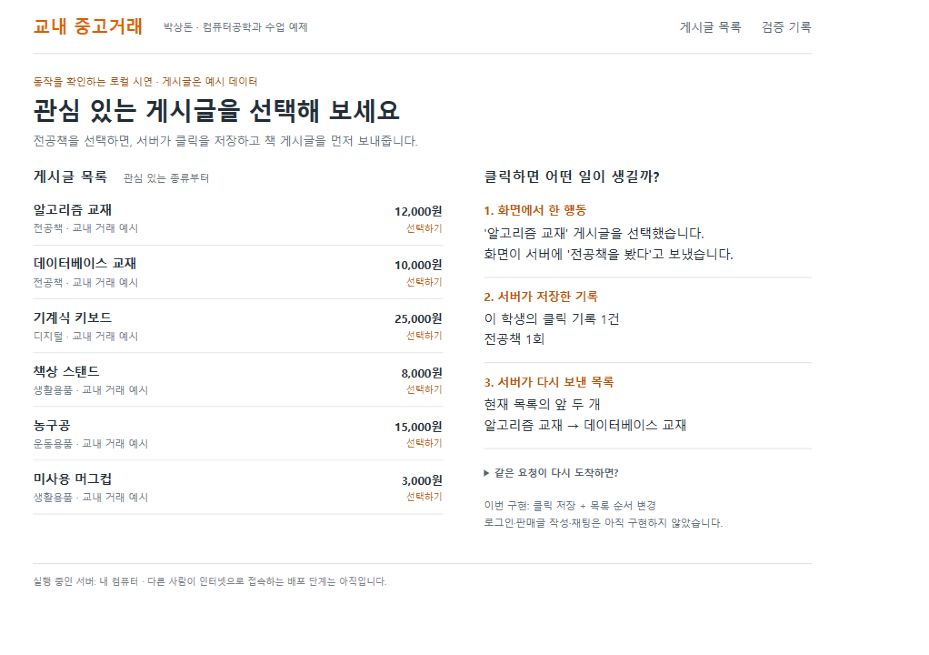

# 1. 클릭 기록 처리 / 실습 예제

취창업역량강화 / 공고의 요구 역량을 연습하는 수업 예제

## 게시글 클릭 기록과 목록 정렬

클릭 정보가 저장되고 다음 목록에 반영되는 과정을 구현한 프로젝트입니다. 요청을 한 번만 반영하는 방법과 사용자별 기록 조회 비용을 검증했습니다.

| 프로젝트 정보 | 범위 |
| --- | --- |
| 제작·검증일 | 2026.09.06 |
| 팀 구성·담당 역할 | 개인 프로젝트 형식의 모의 설정 / 서버 API, DB, 화면, 테스트, 조회 실험 전체 |
| 사용 기술 | Python, FastAPI, SQLite, HTML/CSS/JavaScript |
| 현재 결과물 | 합성 게시글 6개를 사용하는 로컬 실행 프로그램 |

실제 실행 화면 상단 발췌: 클릭 1건을 저장하고 전공책을 먼저 표시합니다.

소개할 핵심 근거: 중복 재전송 처리와 실패 조건 검사, 동일 조건의 SQL 조회 실험.
전체 거래 서비스, 실제 이용자 운영, 추천 모델 학습은 현재 범위에 없습니다.

수업 설명을 위해 제작·검증한 예제이며, 역할은 모의 지원자 설정입니다. 박상돈의 학생 시절 개발 이력이나 실무 경력을 의미하지 않습니다.

# 2. 담당 구현과 기술 선택

코드에서 맡은 범위를 확인할 수 있도록 기능별로 정리했습니다

## 담당한 작업

| 작업 | 구현 내용 | 근거 파일 |
| --- | --- | --- |
| 요청 처리 | 분류·시간 형식 검사, 신규·중복·충돌 응답 | app.py |
| 기록 저장 | 고유 요청 번호, 원본·사용자 요약의 일괄 저장 | store.py |
| 목록 조회 | 사용자별 분류 횟수 집계, 게시글 정렬 | store.py / app.py |
| 시연 화면 | 새 클릭 전송, 목록 갱신, 같은 요청 재전송 | web/app.js |
| 검증·측정 | 12개 테스트, 합성 데이터의 조회 전후 비교 | test_app.py / benchmark.py |

## 이 예제에서 사용한 이유

Python과 FastAPI: 요청 내용을 구조화해 검사하고, 같은 앱을 테스트 클라이언트로 검증할 수 있습니다. 요청을 처리하는 코드와 DB 코드를 파일로 나누었습니다.

SQLite: 별도 DB 서버 없이 파일 하나로 저장과 재접속 검사를 재현할 수 있습니다. 쓰기 작업이 직렬화되므로 높은 동시 쓰기 부하에 적합한지는 별도로 확인해야 합니다.

## 한 번의 클릭이 통과하는 경로

web/app.js가 클릭을 전송합니다. app.py가 입력을 검사하고 store.py가 SQLite에 저장합니다. 화면은 목록을 다시 요청하고, 서버가 클릭 횟수로 정한 순서를 표시합니다.

새 클릭에는 새 요청 번호를 붙입니다. 같은 요청 번호를 다시 보내는 경우에만 중복으로 판단하며, 사용자가 실제로 여러 번 클릭한 기록을 모두 지우지 않습니다.

# 3. 문제 해결 1 / 중복 저장 방지

검증을 위해 설정한 상황: 저장은 성공했지만 화면이 응답을 받지 못한 경우

## 문제와 목표

같은 클릭을 재전송할 때 매번 새 기록으로 저장하면 관심 횟수가 부풀려집니다. 동일한 요청은 한 번만 반영하고, 다른 내용으로 번호를 재사용하면 거부하도록 했습니다.

## 방법을 선택한 이유

| 대안 | 판단 |
| --- | --- |
| 화면 버튼 잠금 | 클릭 연타는 줄이지만 서버로 오는 재전송까지 보장하지 못합니다. |
| 서버 메모리에 번호 저장 | 서버가 다시 시작하면 중복 판단 기록을 잃을 수 있습니다. |
| DB 고유 번호와 트랜잭션 | 재접속 뒤에도 번호를 확인하고 원본·요약을 함께 반영할 수 있어 채택했습니다. |

## 구현

events.event_id를 기본 키로 두고 저장된 본문을 비교합니다. 번호와 내용이 같으면 중복(200), 번호는 같고 내용이 다르면 충돌(409)로 응답합니다. BEGIN IMMEDIATE로 확인·삽입·요약 갱신을 한 트랜잭션에 묶었습니다.

## 확인한 결과

| 검사 | 결과 |
| --- | --- |
| 8개 스레드에서 같은 요청 16회 | 신규 수락 1회, 중복 15회, 저장 횟수 1건 |
| 원본 삽입 직후 오류 주입 | 원본과 요약이 모두 남지 않음, 재시도 후 1건 |
| DB 재접속 뒤 같은 요청 | 이전 기록을 확인해 1건 유지 |

근거: store.py의 ingest, test_app.py의 concurrent_duplicate_submissions / failed_transaction_rolls_back_and_retries / reopen_preserves_idempotency 검사. 실제 서비스 장애 이력 대신 재현한 실패 조건을 제시했습니다.

남은 한계: 단일 SQLite 파일의 쓰기 직렬화와 보관할 요청 번호의 증가. 여러 서버와 긴 보관 기간에서의 동작·비용은 추가 검증 대상입니다.

# 4. 문제 해결 2 / 사용자별 조회 비용

같은 데이터와 같은 SQL을 비교한 로컬 측정 결과

## 문제와 변경

사용자 한 명의 클릭을 모으는 SQL이 전체 events 테이블을 탐색하는 실행 계획을 확인했습니다. events(user_id, category, occurred_at) 인덱스를 추가해 사용자 번호로 먼저 좁혀 읽게 했습니다.

## 측정 조건

합성 이벤트 100,000건, 사용자 1,000명, seed 20260906. 조건당 300회씩 3회차로 총 900회 측정했습니다. 회차·조건마다 30회 워밍업하고, 실행 순서를 기준/인덱스, 인덱스/기준, 기준/인덱스로 바꾸었습니다.

| 회차 | 인덱스 없음 p95 | 인덱스 있음 p95 |
| --- | --- | --- |
| 1 | 4.3541 ms | 0.0843 ms |
| 2 | 4.6296 ms | 0.0823 ms |
| 3 | 6.4508 ms | 0.0901 ms |
| 통합 900회 | 5.3043 ms | 0.0866 ms |

p95는 측정값을 정렬했을 때 95% 지점입니다. 통합 값은 회차별 p95의 평균이 아닌 원본 900개로 계산했습니다.

## 결과의 해석과 비용

변경 전 실행 계획은 SCAN events, 변경 후에는 사용자 조건으로 COVERING INDEX를 SEARCH했습니다. 모든 측정에서 조회 결과가 같았고 SQL 오류는 없었습니다. 인덱스 공간은 약 3.20 MiB 늘었습니다.

측정 범위는 한 프로세스·한 연결에서 워밍업한 SQL 실행과 결과 읽기입니다. HTTP, 네트워크, 동시 부하, 쓰기 지연은 제외했습니다. 이 수치로 전체 서비스 응답 속도나 운영 규모를 주장하지 않습니다.

## 원본과 재현 환경

benchmark.py / evidence/benchmark.json / evidence/latency.csv (1,800행)
Windows 11, Intel Core Ultra 9 285K, 논리 CPU 24개
Python 3.12.14, SQLite 3.53.1 / 측정일 2026.09.06

# 5. 검증 결과와 현재 한계

검사한 조건을 공개하고, 아직 확인하지 않은 범위를 함께 적었습니다

## 자동 테스트 12개 통과

| 검사 묶음 | 확인한 내용 |
| --- | --- |
| 중복·충돌·재접속 · 3개 | 같은 요청 한 번 반영, 다른 내용의 번호 재사용 거부, 재접속 뒤 중복 판단 |
| 시각·사용자 분리 · 3개 | 늦은 기록이 최신 요약을 덮어쓰지 않음, 같은 시각의 일관된 순서, 사용자별 집계 |
| 저장 실패·동시 요청 · 2개 | 원본·요약 함께 롤백, 같은 요청 16회 중 한 번 수락 |
| API·목록·인덱스 · 4개 | 입력 검사, 응답 코드, 새 사용자 최신순과 관심 반영, 인덱스 전후 결과 일치 |

원본: test_app.py, evidence/verification.json, tests.txt, tests.xml.
테스트 실패는 없으며 의존성의 폐기 예정 기능 경고 2건은 원본 로그에 남아 있습니다.

## 현재 서비스 수준과 다음 검증

| 현재 한계 | 다음에 확인할 내용 |
| --- | --- |
| 계정 인증·권한 없음 | 클라이언트의 사용자 번호를 믿는 상태. 로그인과 접근 권한 검사가 필요합니다. |
| 게시글 6개는 합성 데이터 | 작성·수정·삭제 기능과 실제 사용 상황 검증이 필요합니다. |
| 인터넷 공개 운영 경험 없음 | 배포, 오류 기록, 백업·복구와 다른 기기 접속을 확인해야 합니다. |
| 조회 중심의 성능 실험 | 쓰기 비용, HTTP 전체 지연, 동시 부하를 따로 측정해야 합니다. |

사용자별 데이터 분리 테스트는 본인 인증이나 접근 통제의 검증을 대신하지 않습니다. 추천 정확도, 사용자 만족도, 거래 성과는 측정하지 않았습니다.

# 6. 코드와 실행 방법

동봉 소스: campus-feed_실행예제.zip / 공개 저장소와 운영 주소는 아직 없습니다

## 근거를 확인할 파일

| 확인할 주장 | 파일·위치 |
| --- | --- |
| 입력 검사와 목록 정렬 | app.py / create_app 내부의 요청 처리 |
| 중복 판단과 일괄 저장 | store.py / Store.ingest |
| 테스트 결과 | test_app.py / evidence/verification.json, tests.txt |
| 조회 비교의 조건과 원본 | benchmark.py / evidence/benchmark.json, latency.csv |
| 실제 시연 화면 | evidence/screenshots/before.png, after.png, replay.png |

## Python 3.12에서 실행

ZIP을 풀고 campus-feed 폴더에서 아래 명령을 실행합니다.
Windows PowerShell 기준이며 다른 운영체제 명령은 README에 있습니다.

python -m venv .venv
./.venv/Scripts/python.exe -m pip install -r requirements.txt
./.venv/Scripts/python.exe -m uvicorn app:app --host 127.0.0.1 --port 8770

브라우저에서 http://127.0.0.1:8770을 열고 알고리즘 교재를 선택합니다.
같은 요청 재전송 후에도 클릭 수가 늘지 않는지 확인합니다.

별도 터미널에서 검사: ./.venv/Scripts/python.exe verify.py
조회 재측정: ./.venv/Scripts/python.exe benchmark.py
재측정하면 결과 파일이 갱신되며 수치는 장비와 실행 상태에 따라 달라집니다.

## 참고 자료와 실제 제출 시 적용

[당근 공식 채용공고 / 공고 번호 5823087003](https://careers.daangn.com/jobs/role/5823087003/)

[SQLite 공식 문서 / Query Planning](https://www.sqlite.org/queryplanner.html)

[당근 공식 지원 FAQ / 제출 형식](https://careers.daangn.com/faq/지원-관련/)

동봉 ZIP은 수업에서 코드를 확인하기 위한 자료입니다. 당근은 PDF를 권장하고 ZIP 제출을 받지 않습니다. 실제 지원자는 자신의 수행 이력과 접근 가능한 코드 링크를 넣고, 해당 공고의 최신 안내를 확인합니다.
