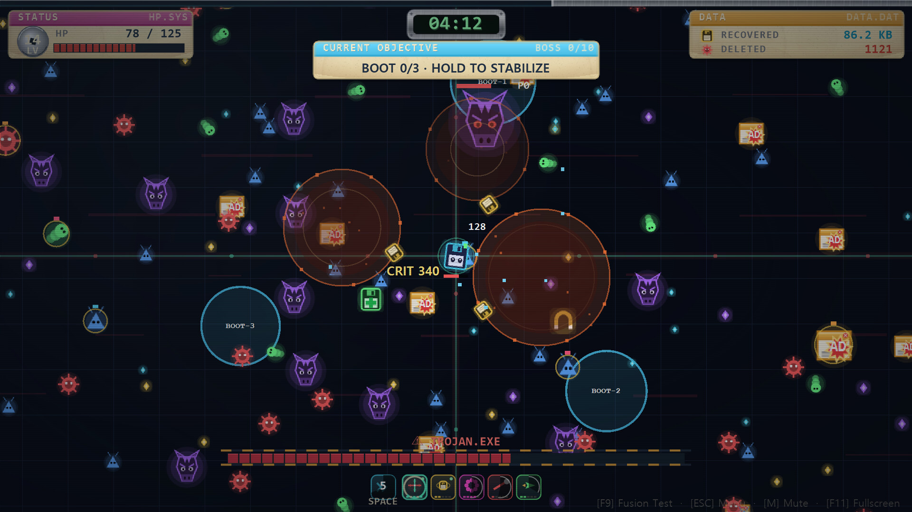
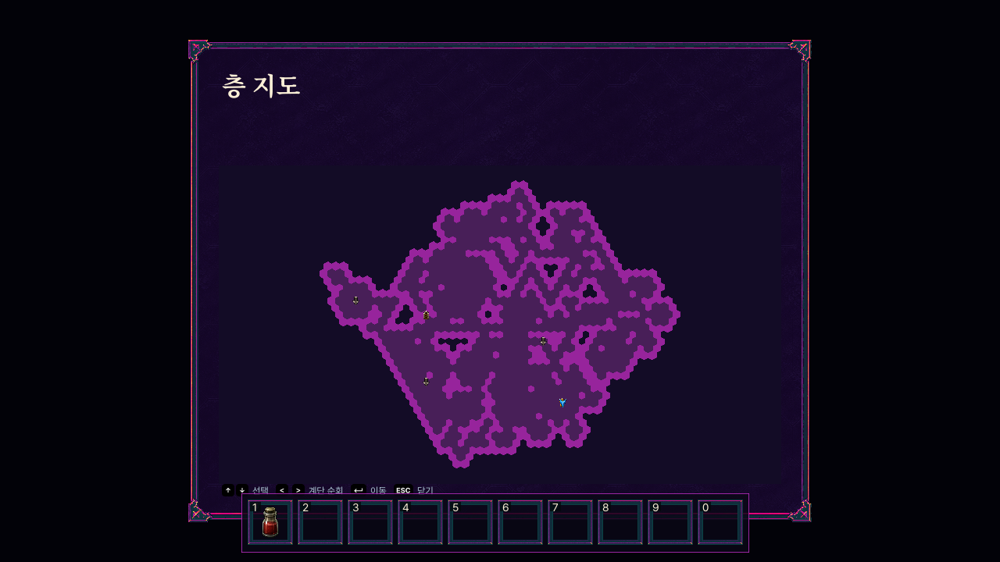

# 1. 박상돈  Sangdon Park

대전대학교 SW융합학부 컴퓨터공학과 조교수 · AxGS Lab

AI 시스템 연구와
게임·웹 서비스 개발

LLM 요청의 처리 위치를 결정하는 연구와, 실제 동작하는 게임·검색 서비스를 개발합니다. 모델과 시스템의 동작을 코드로 구현하고, 비교 실험과 자동 검사로 확인합니다.

관심 분야

LLM 추론 시스템 · 데이터 검색 · 게임 시스템 · 소프트웨어 검증

| 기간 | 소속과 업무 |
| --- | --- |
| 2026.03 - 현재 | 대전대학교 컴퓨터공학과 조교수 / AI·게임 시스템 연구 및 소프트웨어 교육 |
| 2025.05 - 2026.02 | SayBerry Games · 게임 개발 |
| 2017.09 - 2025.04 | KAIST 정보전자연구소 · 연수연구원 |

학력

KAIST 전기및전자공학 박사 2017.08
KAIST 수리과학과 석사 2013.02 · 학사 2011.02

연락처와 공개 자료

[sangdonpark@dju.kr](mailto:sangdonpark@dju.kr)

[홈페이지  sangdon-park.github.io](https://sangdon-park.github.io/)

[GitHub  github.com/Sangdon-Park](https://github.com/Sangdon-Park)

# 2. 역량과 대표 프로젝트

어떤 기술을 사용했고, 무엇을 직접 구현했는지 연결했습니다

| 기술 역량 | 직접 구현한 내용 | 사례 |
| --- | --- | --- |
| Python · 실험 설계 | 요청·대기열 모델, 처리 위치 결정 정책, 동일 조건 비교 | 3쪽 |
| C# · 게임 개발 | 전투·성장, 오디오 합성, 실행 파일 용량 검사 | 4쪽 |
| Go · 게임 시스템 | 전투·경영, 던전·저장 상태, 제품별 빌드, 회귀 검사 | 5~6쪽 |
| TypeScript · 검색 서비스 | Next.js API, Postgres·pgvector 혼합 검색, 답변·출처 전달 | 7쪽 |

대표 사례에서 보여 주는 판단

| 프로젝트 | 핵심 기여와 확인 결과 |
| --- | --- |
| LLM 추론 위치 결정 | 현재 서버 대기 상태를 반영한 정책과 비교 실험 |
| Floppy Survivors | 오디오를 실행 중 합성하고 빌드 용량 상한 검사 |
| Beasts of Ephesus | 같은 코드에서 전체판·체험판 규칙과 저장 경로 분리 |
| Hexagon Soup | 포팅 회귀 검사와 동일 시드의 탐색 결과 비교 |
| 건축 규정 RAG | 의미·키워드 검색을 결합하고 조문 출처를 답변에 연결 |

게임 3종은 Beff Inc.(SayBerry Games)와 공동 개발했습니다. 개인 기여는 직접 작업한 코드의 구현 범위로 적었으며, 팀 규모나 기여율은 추정하지 않았습니다.

[공개 게임 프로젝트 소개](https://sangdon-park.github.io/games.html)

# 3. LLM 추론 위치 결정 연구

State-Dependent Quality Threshold Offloading · 2026 연구 원고 심사 중

현재 대기 상태를 반영하는 처리 위치 선택 정책

문제

질문을 가까운 소형 모델에서 처리할지, 클라우드의 큰 모델로 보낼지 결정합니다. 품질만 보고 클라우드를 선택하면 대기·전송 시간이 늘어날 수 있습니다.

내 역할

요청 생성, 대기열 시뮬레이터, 처리 위치 결정 정책과 비교 실험을 구현했습니다. 같은 요청을 여러 정책에 넣고 지연·품질·비용을 함께 비교했습니다.

기술적 선택

현재 대기 시간, 무선 전송 속도, 예상 출력 길이를 사용해 클라우드로 보낼 품질 기준을 조정했습니다. 고정된 대기 시간을 가정한 정책 등과 비교했습니다.

| 비교 정책 | 종합 목적값 · 낮을수록 좋음 |
| --- | --- |
| 고정 대기 시간 기준 | 10.62 |
| 현재 대기 상태를 반영한 제안 방법 | 8.35 |
| 지연을 고려하는 비교 방법 | 8.65 |
| 5단계 앞을 탐색하는 비교 방법 | 8.00 |

기준 정책 대비 종합 목적값 21.3% 감소

목적값 = 지연 + 12 × 품질 부족분 + 비용. 응답 속도 개선율이 아닙니다. 이 실험에서는 5단계 탐색 정책이 더 낮은 목적값을 보였습니다.

조건: 난수 시드 20260315 · 동일 요청 4,000건 · 평균 도착 간격 3.5초. 저장된 시뮬레이션 기록이며 실제 이용자 서비스의 운영 성과와 구분합니다.
공동 연구: Sangdon Park, Joohyung Lee

근거: sdqto-wcl/simulator.py · cached/experiment_summary.json

# 4. Floppy Survivors

C# · .NET Framework · 절차적 오디오 · Beff Inc. 공동 개발

오디오 합성과 빌드 검사로 실행 파일 용량 제한 대응

프로젝트와 내 역할

감염된 디스크를 복구하는 서바이버 게임입니다. 전투·무기 융합·복구 진행, 오디오 합성 코드와 배포 빌드를 작업했습니다.

기술적 선택

음원 파일 대신 파형과 음표 데이터로 음악·효과음을 실행 중 합성합니다. 전체판·데모·플레이테스트는 같은 소스에서 별도 빌드하고, 용량 상한을 넘으면 빌드가 실패하도록 했습니다.

| 확인한 산출물 | 크기·기준 |
| --- | --- |
| 로컬 전체판 실행 파일 | 1,006,592 bytes |
| 빌드가 허용하는 상한 | 1,474,560 bytes |

2026.09.06 확인한 실행 파일 기준입니다. Windows와 .NET 실행 환경은 포함하지 않습니다. 공개 화면은 개발 중 게임의 실제 화면이며 출시 성과를 의미하지 않습니다.

[Steam 공개 상점 · 출시 예정](https://store.steampowered.com/app/4997880/Floppy_Survivors/)

근거: 1.44mb/survivor/src/Audio.cs · build.cmd · build_dist.cmd

# 5. Beasts of Ephesus

Go · Ebitengine · 전투·경영 시뮬레이션 · Beff Inc. 공동 개발

전체판과 체험판의 규칙을 같은 코드에서 분리

프로젝트와 내 역할

선수 영입·육성, 리그 진행과 전투를 연결하는 게임입니다. 해당 시스템과 화면 없이 진행·저장을 검사하는 도구, 제품별 빌드 설정을 개발했습니다.

기술적 선택

제품별 코드를 복사해 관리하는 대신, 빌드 태그로 체험판 진행 제한과 저장 경로를 확정했습니다. 전체판 설정에 체험판 제한이 섞인 경우는 검사에서 거부합니다.

| 제품 설정 | 전체판 | 플레이테스트 |
| --- | --- | --- |
| 진행 제한 | 없음 | 표시 주차 26주 |
| 저장 폴더 | PaulSoupManager | PaulSoupManager-Playtest |

확인 근거는 제품 설정 코드와 profile_test.go입니다. 공개 상점은 출시 예정 상태이며, 이용자 수나 출시 후 성과는 포함하지 않았습니다.

[Steam 공개 상점](https://store.steampowered.com/app/4910030/Beasts_of_Ephesus/)

근거: PaulSoupManager/internal/buildprofile/ · docs/BUILD_PROFILES.md

# 6. Hexagon Soup

Go · Ebitengine · Python 게임 포팅 · 절차적 던전 생성

같은 난수 시드로 던전 탐색의 수정 전후 비교

내 역할과 개선 과제

Python 게임의 전투·탐색·저장을 Go로 이식하고 기준 데이터로 회귀 검사했습니다. 초반 던전의 탐색 면적과 통로 구조를 조정한 뒤 같은 시드로 자동 플레이를 비교했습니다.

| 자동 플레이 결과 | 수정 전 | 수정 후 |
| --- | --- | --- |
| 궁수 · 목표 도달 | 12 / 12 | 12 / 12 |
| 같은 궁수 실행의 총 이동 수 | 21,090 | 13,511 |
| 화염 마법사 · 목표 도달 | 10 / 12 | 12 / 12 |

궁수의 총 이동 수 35.9% 감소

2026.09.05 기록. 로그라이크 난이도, shatterway 4층 완료 목표, 캐릭터 3종 × 동일 시드 12개. 표는 그중 두 캐릭터의 결과입니다. 자동 플레이 결과이며 사람의 만족도나 전체 게임 난이도 지표는 아닙니다.

공동 개발 프로젝트입니다. 기존 렌더러·라이브러리의 원저작권은 각 프로젝트에 있습니다.

[Steam 공개 상점 · 출시 예정](https://store.steampowered.com/app/4256880/Hexagon_Soup/)

근거: GoHexSoup/reports/balance-fixes-2026-09-05/summary.json

# 7. 건축 규정 RAG 서비스

TypeScript · Next.js · Supabase Postgres·pgvector · Gemini

검색한 조문을 답변과 연결하는 질문 처리 흐름

서비스와 내 역할

질문에 관련된 건축 규정을 검색하고 답변과 출처를 함께 보여 주는 서비스입니다. 법규 수집·색인, 질문 API, 혼합 검색과 출처 전달을 구현했습니다.

| 처리 단계 | 구현 내용 |
| --- | --- |
| 질문 접수 | /api/chat에서 질문과 사용량 제한 확인 |
| 조문 검색 | 의미가 유사한 조문과 검색어가 일치하는 조문을 각각 조회 |
| 결과 결합 | 의미 검색 0.65 + 키워드 검색 0.35 + 관련도 보정 / 법령·자료 종류 필터와 조문 ID 중복 병합 |
| 답변 생성 | 상위 8개 근거를 모델에 제공하고 응답 스트리밍 |
| 출처 전달 | 조문·출처 정보를 응답 데이터와 함께 화면에 전송 |

기술적 선택

의미 검색과 키워드 검색을 함께 사용해 법령명·조문 표현을 반영하도록 했습니다. 수집·임베딩 생성은 질문 처리와 분리해, 요청 때 전체 법규를 다시 처리하지 않도록 구성했습니다.

현재 확인한 범위

근거는 서비스 코드와 DB 구조입니다. 검색 정확도나 답변 신뢰도의 정량 점수는 제시하지 않습니다. 평가 질문과 기준 답안을 마련해 품질을 별도로 측정할 수 있습니다.

근거: Building/src/app/api/chat/route.ts
src/lib/rag/retrieve.ts · supabase/migrations/0001_init.sql

# 8. 연구 성과와 교육 활동

연구 결과를 논문·코드로 남기고 개발 경험을 소프트웨어 교육에 연결합니다

2024 · 제1저자

Real-Time Dynamic Pricing for Edge Computing Services: A Market Perspective

[IEEE Access 12, 134754-134769 · DOI](https://doi.org/10.1109/ACCESS.2024.3462499)

2022 · 교신저자

Differential Pricing-Based Task Offloading for Delay-Sensitive IoT Applications in Mobile Edge Computing System

[IEEE Internet of Things Journal · DOI](https://doi.org/10.1109/JIOT.2022.3163820)

2020 · 교신저자

Competitive Data Trading Model With Privacy Valuation for Multiple Stakeholders in IoT Data Markets

[IEEE Internet of Things Journal 7(4), 3623-3639 · DOI](https://doi.org/10.1109/JIOT.2020.2973662)

2026년 2학기 교육

알고리즘 · 생성형 AI 소프트웨어공학 · 캡스톤 디자인 2. 문제 정의와 구현, AI 활용, 검증 과정을 연결하는 강의 자료를 공개하고 있습니다.

추가 개발 경험

학생·기업의 활동과 채용 정보를 연결하는 SW-Platform, 대화 파일을 파싱하고 통계를 보여 주는 KakaoTalk Chat Analyzer 등 웹·데이터 처리 프로젝트를 개발했습니다.

[전체 논문 목록](https://sangdon-park.github.io/publications.html)

[강의·연구·프로젝트 자료](https://sangdon-park.github.io/ko.html)

자료 기준: 2026.09.06. 코드·저장된 실험 기록·공개 페이지에서 확인한 내용을 정리했습니다. 상세 근거 위치와 측정 조건은 함께 제공한 포트폴리오_근거표.md에 수록했습니다.
